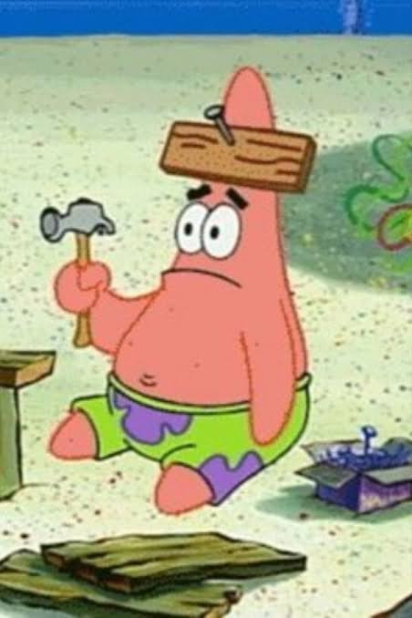

<a href="https://www.youtube.com/results?search_query=spongebob+squarepants+theme+song"><samp><b>SpongeBob SquarePants</b> - Theme Song</samp></a> 
<samp>▶&nbsp;&nbsp;━━━━━━━●───────────&nbsp;&nbsp;0:42 / 1:30</samp>

 

<i>"is mayonnaise an instrument?"</i>

<samp>"i don't need to write tests. i already know it works. i wrote it."</samp> — patrick, probably

<i>"firmly grasp it."</i>

<samp>"the code doesn't have a bug. it has a feature nobody asked for."</samp> — patrick, probably

<i>"i can't see my forehead."</i>

<samp>"git push --force? that sounds strong. i like strong."</samp> — patrick, probably

<i>"we should take bikini bottom and push it somewhere else!"</i>

<samp>"it works on my rock."</samp> — patrick, probably

<i>"the inner machinations of my mind are an enigma."</i>

<samp>"i turned it off and on again. now it's off."</samp> — patrick, probably

<i>"no, this is patrick!"</i>
